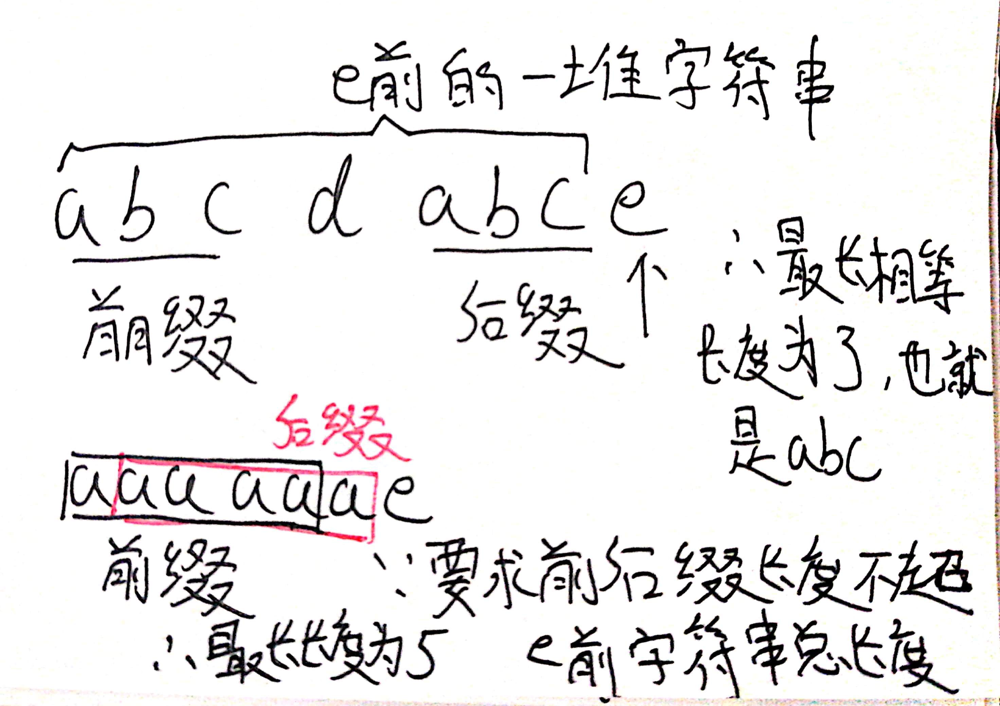
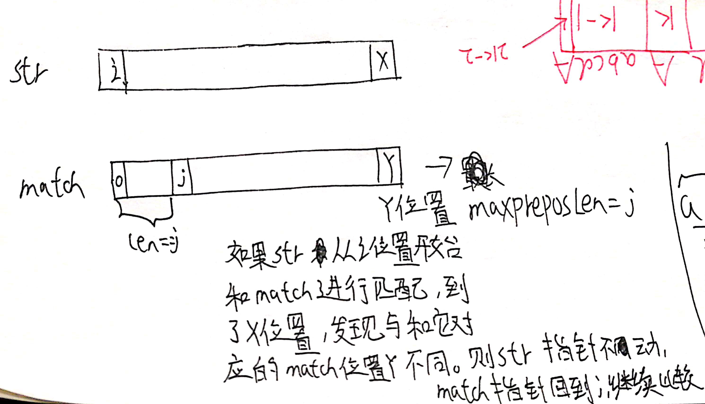
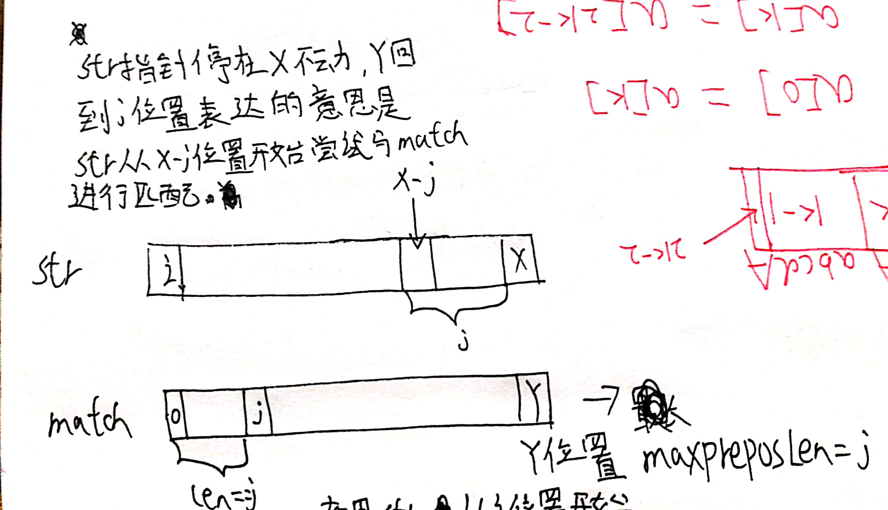
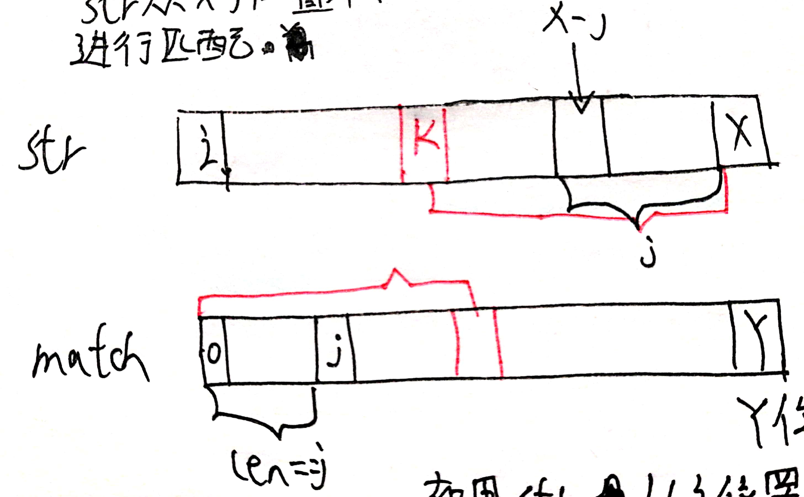
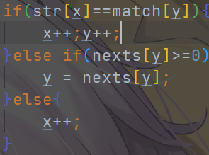
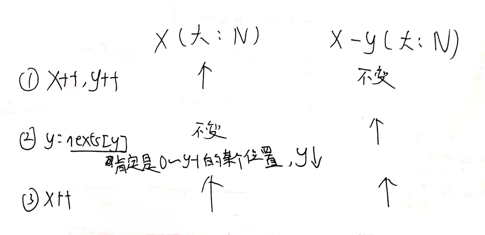
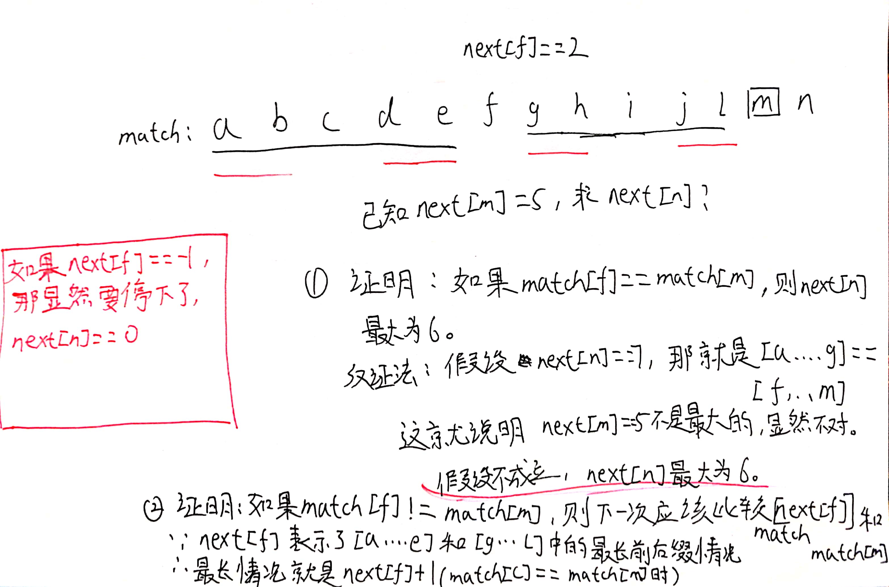
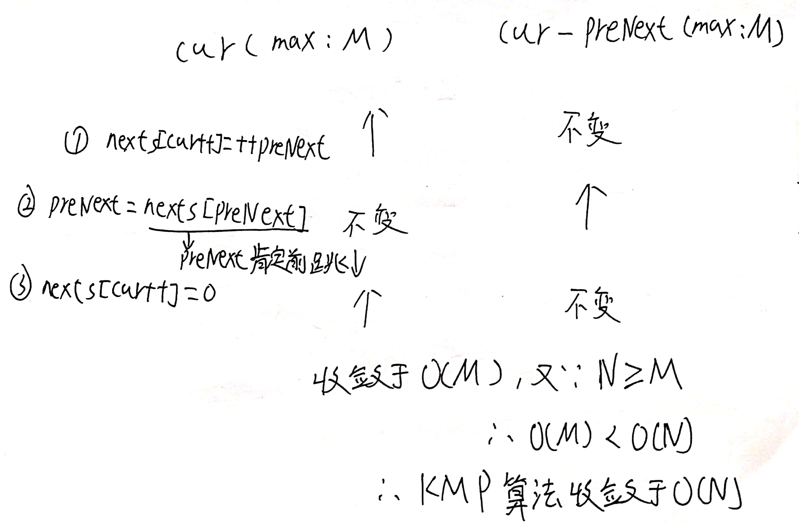

# KMP算法

假设字符串str长度为N，字符串match长度为M，**M <= N**，想确定str中是否有某个子串是等于match的。

时间复杂度O(N)

## 暴力解

直接遍历，以i(0~N-1)位置开始尝试趟一遍match看看是否能够匹配，如果不匹配就i++继续尝试，如果有一个i是能够匹配的就返回这个i，否则返回-1。最坏情况下，每次都趟了M-1个字符，在最后一个才发现不匹配，然后直到i==N-M的时候才匹配成功。这样时间复杂度就是O(N*M)，如果M非常接近N，那么时间复杂度接近O(N^2)。

KMP算法就是将这个匹配过程给优化到O(N)，着眼点就是暴力匹配中存在大量的重复比较。

## 必要铺垫

**在介绍KMP算法前先介绍一个概念**

字符串**i位置**字符**前的字符串**中，前缀字符串和后缀字符串相等的最大长度(<i前字符串长度)，这两个字符串的长度都是要小于i位置前的字符串长度的。



这个**某个位置前的字符串最长相同前后缀字符串长度**(这玩意我也不知道学名是啥)就是KMP算法的精髓，0位置的这个值人为规定为-1，因为前面没有字符，1位置这个值人为规定为0，因为前面就一个字符，要求长度要小于前面的字符串长度，所以小于1，设置为0无可厚非。

假设我们已经获得了每个位置的这个长度的值，那么怎么能够优化比较的过程呢？

这就是KMP算法**真正优化**的地方了，暴力匹配的问题就是i位置开始如果匹配不成功下一次就从i+1位置开始进行重新匹配，从而浪费了之前比较失败的一些字符串特征。

## KMP算法流程

之后为了简单起见那个**最长...长度**我就直接叫**maxPrePosEqlLen**了



## 理解流程的两个关键点

1.为什么str指针不用动，留在x，而match指针要回退到j位置？



由于str是从i位置开始和match进行匹配，直到x,y位置才匹配不上的，所以str中[i...x-1]和match中[0...Y-1]部分是完全相同的，而match中[0...j-1]部分正好是Y位置的最长前缀字符串，str中[x-j...x-1]部分正好等于Y位置的最长后缀字符串，所以它们**肯定相等就不用比对了**，让str直接从x开始，match直接从j开始继续比对。

2.像是暴力解很好理解，i位置比对不上，那我从i+1位置继续尝试比对就好了，那肯定是正确的。**为什么我现在不从i+1位置开始比对，而是从x-j位置比对呢？这样能保证正确性吗？**

**证明：为什么从i+1到x-j-1位置开始没有一个是能够匹配match的？**

如果这些位置都不可能，那么肯定可以直接淘汰，我从x-j位置开始尝试匹配就合理了，而且大大加速了匹配的速度。



## 反证法

假设从i+1到x-j-1中间的某个k位置出发能够匹配match，那么就会有**str中k...x-1**这一段匹配上**match中0...x-k-1**这段，由于**str中i...x-1和match中0...Y-1**这一段完全相等，而**k...x-1这一段距离x-k是肯定比j要长的**，所以说Y位置就会有一个比j还要长的maxPrePosEqlLen。这是不可能的，因为我们一开始求的maxPrePosEqlLen就是最长的，就是建立在求的maxPrePosEqlLen正确的情况下进行算法的。所以假设不成立，i+1到x-j-1中间任意某个k位置出发必不可能匹配match。所以可以从x-j重新出发。

KMP算法证明成立，可以跳过i+1到x-j-1中间的所有位置，从x-j位置重新出发，这真的起到了加速效果吗，时间复杂度能否收敛到O(N)?

## 算法实现和分析时间复杂度

### 算法实现(java)

```java
public static int getIndexOf(String s, String m) {
    if (m.length() > s.length()) return -1;
    char[] str = s.toCharArray();
    char[] match = m.toCharArray();
    //maxPrePosEqlLen信息就存在这个数组中i位置的值就对应nexts下标i的值
    int[] nexts = getNextArray(match);
    int x = 0, y = 0;//x是str的工作指针，y是match的
    //为什么循环条件这么写，因为x,y都是从0位置往后匹配的，匹配不上则y回跳
    //匹配上则x前走，不管匹配得上还是匹配不上，最终总有至少有一个会到length
    while (x < str.length && y < match.length) {
        if(str[x]==match[y]){
            x++;y++;//匹配上了，都后移，非常合理
        }else if(nexts[y]>=0){
            //x不动，y移动到最长前缀的后一个位置，假如最长前缀长度为j，那么0~j-1就是最长前缀，所以j就是现在y应该去的地方，这也是为什么maxPrePosEqlLen数组叫做next数组，代表了y下一跳去的地方
            y = nexts[y];
        }else{
            //说明str指针从x-j位置到x位置开始一个都匹配不上，那么x以及x前的位置淘汰，x++，很合理
            x++;
        }
    }
    /*
    分析：
    1.x==str.length&&y==match.length,那么说明x从str.length-match.length位置开始匹配上了match
    2.x==str.length&&y!=match.length,那么说明str都走完了，所有位置都淘汰了还是匹配不上match，返回-1
    3.x!=str.length&&y==match.length,说明str中间某个串就匹配上了match，这个开始位置是x-match.length
     */
    return y==match.length?x-match.length:-1;//结合所有情况，合理
}
```

### 时间复杂度

#### 两种求解方式

#### 方式一



每个分支其实逻辑上都会造成match数组向右移和str对齐，而match最多向右走N-M，所以是O(N)

#### 方式二



这个分析方式就很骚了，虽然你y是左右横跳，但是x-y的值却是最大为N的，而且处于单调上升的趋势，所以不管你y啥取值，最终也是只会蹦跶N次直到x-y到最大值N就停止。而x最大也是取到N，所以进入循环最多2N次，整体时间复杂度O(N)。

OK，KMP算法整体流程咱们分析过了，只要现在求解next数组的时间复杂度收敛到O(N)，那么算法就能够收敛到O(N)了。

## 求解next数组

next数组也就是maxPrePosEqlLen数组了，因为可以代表y下一跳的位置，所以叫next数组。

分析：match数组长度为M

①如果y==0，那么next[y]==-1,人为规定，没得好说

②如果y==1，那么next[y] ==0,人为规定，没得好说

③y>=2怎么求？



## 算法实现和分析时间复杂度

```java
public static int[] getNextArray(char[] match) {
    if (match.length == 1) return new int[]{-1};
    int[] nexts = new int[match.length];
    nexts[0] = -1;
    nexts[1] = 0;
    int cur = 2;
    //这代表的是cur前一个位置的next的值也代表需要和cur比对的match中的下标,理解这个很重要
    int preNext = 0;
    while (cur < match.length) {
        if (match[cur - 1] == match[preNext]) {
            //每个cur位置都是要看上一个位置的next的，上个位置设置的时候next = preNext+1,所以就干脆直接修改preNext为preNext+1了
            nexts[cur++] = ++preNext;
        } else if (preNext>0) {//nexts[preNext]>=0同于preNext>0
            //不符合还能往前跳就继续往前跳
            preNext = nexts[preNext];
        } else {
            nexts[cur++] = 0;
        }
    }
    return nexts;
}
```

#### 时间复杂度

和之前一样用骚操作来推算，preNext虽然反复横跳，但是cur-preNext是要么不变，要么递增的。

