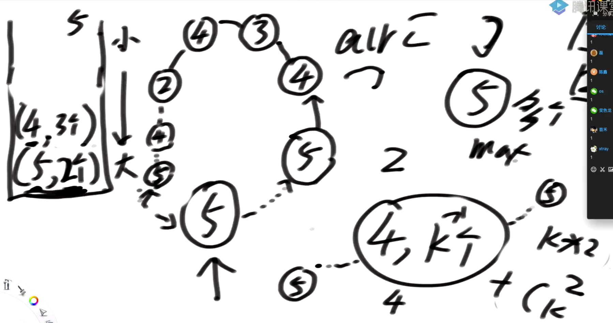

[TOC]

## Tips

### 动态规划

**为什么要严格的动态规划，同样的复杂度记忆化搜索不好写多了？**

- 建立严格动态规划是为了建立空间感，能够知道每个位置都依赖哪些位置，如果只是依赖有限几个位置，dp[i] [j]在O(1)就能做出来那就不需要用严格的动态规划了，但是如果底层有枚举，dp[i] [j]得O(N)才能出来就需要注意了，可能枚举能够进行优化。(基础班硬币数和股票第三问用到了)

- 枚举优化的关键点就是看看当前在求的(i,j)附近已经求过的位置中有没有已经求过(i,j)位置那个枚举的部分数了，比如说dp[i] [j]需要枚举dp[i] [j...0]，但是已经求过的dp[i] [j-1]枚举的是dp[i] [j-1...0]那就爽了，直接利用dp[i] [j-1]来加速求dp[i] [j]。主要看画表，表中填好之后一个位置依赖哪些位置一目了然

  

**动态规划tips:模型选择**

- 如果传入一个可变参数，猜从左到右的模型，注意：不是只有一个参数才能用从左到右模型，是一种思路，如果后面的流程需要依靠前面的流程结果，走到i位置带着一些数据，然后考虑走下去那就是从左到右的尝试模型，一个整数不够用就加，注意尽量别让可变参数突破到二维以上，前到后、左到右如果看不穿，没前途就从后往前看。
  - 从后往前看有什么好处？从结果推原因，这样前面的数据不用往下传，能够省参数。比如说**（39-蛇蛇移动）**，返回的参数别被限制了，一个搞不定就两个，就是可变参数尽量压在两个整数，这就是一张二维表，突破Integer就不好严格动态规划了。
- 如果传入两个可变参数
  - 如果这两个可变参数是下标，猜范围尝试模型(对角线直接填，左下角淘汰)，（**39-牛牛回文串，39-最长回文序列**）
  - 如果这两个可变参数不是下标，是两个整数，那就猜行列对应模型，注意行列对应不是字符串的专属，而是讲的一个二维表，一个数做行，一个数做列，拉出一张rows*cols的二维表。（**40-正数裂开方法数**）
- 如果题目里是告诉你矩阵中咋走咋走，那就可能是业务限制的尝试模型了，特别是矩阵告诉你走来走去的，一般都是从后往前看的模型，从结果进行倒推，反正到了最后一个两个数的base case直接就能出来，递归绝对跑的完(39-蛇蛇移动、地下城游戏(骑士救公主)、捡樱桃)

**动态规划题的做法**

1. 先估摸大概用啥模型，模型不是框，模型是用来刺激你的想法的，按照经验，从左到右的模型得写暴力尝试去摸索状态转移方程**(看暴力解问题出在什么地方，这种动态规划一般是对暴力解的优化)**，但是二维的那两个模型，范围和行列对应一般是用示例建表直接空间推状态转移。
2. 特别的，范围模型一般就是看首尾，咋把左去了，咋把右去了，然后将问题抛给子过程。而行列对应模型一般看最后一个位置，看它依赖哪些位置的子流程然后利用子流程退出它的结果。
3. 评估模型的时候其实可以转成分析题中出现了几个数，把那数往参数上一放就能整出动态规划了

# 索引

## 27-训练营第三期——class01

## 28-训练营第三期——class02

## 29-训练营第三期——class03

## 30-训练营第三期——class04

## 31-训练营第三期——class05

## 32-训练营第三期——class06

## 33-训练营第三期——class07

## 34-训练营第三期——class08

## 35-训练营第四期——class01

## 36-训练营第四期——class02

## 37-训练营第四期——class03

## 38-训练营第四期——class04

**1.天际线问题(线段树、有序表)**

**2.两个有序数组求合并后的中位数**

- 等长有序数组的上中位数
- FindKth

**3.约瑟夫环**

## 39-训练营第四期——class05

### **1.最长回文序列(行列对应模型、范围尝试模型)**

### **2.蛇蛇的最大长度(业务尝试模型)**

​	对于矩阵里走路这种，问你走到某个位置的一些长度、路径之类的东西，一般来说有两种思路：

​			1.按照题目说的，假设当前来到(i,j)位置，按照题目的说法咋走就咋走，				然后来到结尾位置抓答案

​			2.从后往前看，当前在(i,j)位置，按照题目的说法，咋样才能走到(i,j)位				置，然后该咋抓答案咋抓答案。

​			总结：经验来说一般第二种思路是更加容易做的，第一种总是得将当前的某种状态下传，使得可变参数增多，然后复杂的量级增大。

### **3.表达式计算**

​	关键点

​		1.括号用递归处理，这样每个子流程都是负责解决一个不含括号的式子的答案

​		2.存信息不用普通的栈，而是用双端队列，压入的时候从后面压入，计算的时候从前面弹出，因为+-运算是从左到右的

​		3.关于负数不需要特殊管，计算的时候先弹出第一个看看是数还是负号，是数就直接res=num1,不是则每次弹两个出来计算，这样就相当于

-2+3+4--》0-2+3+4

### **4.牛牛想知道有多少种不同的回文串(范围尝试模型)**

这题简直又刷新了我对递归威力的估计，太秀了，简直就是一个数你能完的花样，子流程都能给你，父过程难搞那就不搞了，全推给儿子们，或者说给下面小弟下发任务。

## 40-训练营第四期——class06

### **1.正数裂开的可能性**

---(做出严格的动态规划，底层使用了枚举行为，枚举有时可以优化)

### **2.多少种排列能正好形成K个逆序对**

### **3.最大的BST拓扑结构**

- 引入概念，节点对于树的最大BST拓扑结构的最大贡献数

  - 什么意思？

  - 比如说

    - ​	2
    - 1      3

    上面这个BST拓扑结构，1和3为2节点引出的这个最大的BST拓扑结构分别贡献了1个数，而加上自己，这个BST拓扑结构的大小就是3

### **4.完美洗牌问题**

​	----[L1,L2,L3,L4.....|R1,R2,R3,R4]-->[R1,L1,R2,L2,R3,L3.....]

- 一个位置在洗牌之后去到哪里是非常容易知道的，Ri在洗牌之后会去到(i-N)*2-1位置，i是序号，Li在洗牌之后会去到2\*i位置，这是O(1)可以知道的

- 按照1的思路，如果说1去把2顶起来，2去把4顶起来...，如果所有位置只组成一个环那么很容易就能解决问题，把这个环轮一遍就完事了，但是如果这种环不止一个就搞不来了

- 问题现在就变成了---咋知道有几个环，入环点都在哪儿？解决了这个问题，那么挨个环轮一遍问题也能解决了，这就用到下面这个**完美洗牌问题的牛逼结论**，在长度为2,8,26....3^k-1(偶数)下，入环点分别为1,3,9....3^(k-1)，注意这里不是说8这种只有一个入环点3，而是8-->（1,3），26-->(1,3,9)这样子。

- 那么有了这个结论之后，如果给你一个S不是等于3^k-1的咋办？比如说S=10 

  I.）完美洗牌结论

  这里的k都是同一个值，比如说8，那么k==2，也就是会有1,3两个入环点

II.)依赖的算法原型，给你一个数组，这个数组从j位置作为分界线，分为L....j和j+1....R两部分，如何将这个数组右侧数据换到左边来，变成[j+1...R,L...j]这样

我们现在已经来到如何解决一个普通的偶数的问题这里了，假设S=10，我们可以这么来做，10进3^K-1里找到一个小于等于10且最接近10的数，那就是8，那么我们可以这么做

原数组：L1，L2，L3，L4，L5|R1，R2，R3，R4，R5

​											|

​											V

利用算法原型--》数组：

​				L1，L2，L3，L4，R1，R2，R3，R4|L5，R5

这样左边正好可以用完美洗牌结论的8解决左半部分，右边也同理去够，够到的是2，那么就直接解决右边

**时间复杂度O(N)的证明：**

**5.可见山峰对问题**

i.）山峰高度不重复的情况下，直接公式计算O(1)

每个位置作为可见山峰对中小的那个去往外看

- 这个位置如果不是最大位置，也不是次大位置，它往顺时针和逆时针看过去的y和z就是和它组成逆序对的两个山峰，在x..y之间和x...z之间的数都小于x，而在y后，z后的数都看不到，被y，z挡住了，所以除了最大值和次大值之外，剩余位置作为小山峰能够组出(N-2)*2对可见山峰对，加上次大看向最大这一对，所以此时最终公式就是2N-3,除了只有1个的时候不符合，1--》0

ii.)可能有重复值

关键点：用最大值打底，秀秀秀，这样其他的爱出出，不会把底给出了，这样不会漏答案，因为最大的值如果按照"小找大"的原则去找是不可能在外面再找到山峰的，只会在自己内部可见

## 41-训练营第四期——class07

### **1.子序列累加和求余M之后的最大值**

**动态规划再添新tips:**

​	题目中出现的可能参数

- 数组下标(0~len-1)

- M(0~M)

- 子序列和的可能性(0~SUM)

  方法一：index和M结合整个，dp[i] [j]表示[0....i]这个下标区间的子序列和%M是否能凑出j，时间复杂度O(N*M)

  方法二：index和SUM结合整个，dp[i] [j]表示index=[0....i]这一段是否能凑出j这个数，这样算完之后，最下面一行就遍历一边找出%m最大那个O(N*SUM)

  方法三：NP思路

  - 将数组分为左右两部分，然后两部分都进行穷举，找出所有可能的子序列，众所周知，长度为N的数组找子序列的时间复杂度是O(2^N)，所以对于整个数组的这个复杂的无法容忍，但是切半了就能省很多复杂度，之前是O(2^20)现在能直接变成O(2^10)+O(2^10)
  - 答案可能性分析，抓答案，答案可能是左边的序列，可能是右边的序列，可能是跨左右的序列

  总结：经典看菜下饭，看题目给的条件选择时间复杂度好的算法

### **2.一个BST中有两个数调换了位置，将它们找到并且调换回来**

- 找到这两个数，思路：这两个数肯定一个大一个小，因为BST中的数不重复，那么调换位置之后就出现了两对逆序对，那么e1就是第一个逆序对的第一个数，e2就是最后一个逆序对的第二个数，毋庸置疑。就算是这两个节点是父子节点，调换之后只有一个逆序对，也符合这个条件。

- 调换是个大活

  - e1,e2不在一起，不挨着，还得考虑e1,e2是否为头，牵扯到换头问题

    - 假如说e1或者e2为头，又牵扯到一个问题，那就是此时为头的这个节点没有父节点，又扯出两种情况
    - 不挨着，不为头，（两种×，这个时候究竟是e1在上还是e2在上已经不重要了），又牵扯到一个问题，此时两个节点分别是它父节点的左孩子还是有孩子，两种情况，总共4种
    - 不挨着，其中一个为头，两种，加上左右孩子问题，有4种

  - e挨着，这时有两种情况，因为e1在中序遍历中必然在e2前面，还得考虑，这两个节点是否为头

    - 为头，2种
    - 不为头，4种

    ①			e1						②            e2

    ​						e2						e1

  总共14种情况，都调对问题就解了
  
  **节点调转问题考虑关键点，1.是否换头(可以使用哑节点简化问题)2.父环境调对3.子环境调对**

### **3.项目编排(手写改堆)**

利用唤醒机制，很巧妙，就是用程序员苏醒的时间作为整个时间线的推进，这种题一般思路简单，就是进行过程的模拟，难点在于手写堆，要熟练。其实主要就是三个方法：

- 1.heapify (向下找，至少有左孩子才需要比对)
- 2.heapInsert (向上找，每次除以2)
- 3.swap(将索引调对，维护好IndexMap)

### 4.正则表达式匹配

将问题简化，只要聚焦于看*号的处理，其他位置处理都是相同的

## 42-训练营第四期——class08

### 1. [514. 自由之路](https://leetcode-cn.com/problems/freedom-trail/)

### 2.[312. 戳气球](https://leetcode-cn.com/problems/burst-balloons/)

​	两种思考方式，考虑每个气球被扎爆的情况，也就是从左到右的尝试模型,这时候会不知道左右的气球状况，得整个复杂类型来保存，无法试下去。

​	从底向上逆向思考，就是枚举每个位置作为最后一个扎破的气球，此时其它气球都破了，所以左边\*(L-1)，右边\*(R+1)

### 3.汉诺塔问题--当前是最优解第几步

N层汉诺塔的最优解步数是2^N-1,N是盘子的个数。

定义递归f(i,from,other,to,arr)含义为arr[0~i]这个状态是i+1个盘子玩汉诺塔游戏的最优解的第几步，注意不要死扣某个状态，而是每个状态根据递归含义维护好当前的返回。

### 4.合成一个数的最小代价

## 43-LeetCode高频题

### [29. 两数相除](https://leetcode-cn.com/problems/divide-two-integers/)

**两数相加**

无运算符的加减乘除咋算：

加法：

**无进位加法**

加法的难点在哪，如果是无进位的加法，那好做，a+b = a^b;但是进位的信息如何进行保存呢？

**进位信息**

a+b-->进位信息为：(a&b)<<1,挺好理解，就是如果1对上了1就会出现进位，此时&一下就会将可能出现进位的位给摘出来，然后左移就能知道进位后的样子。

最终无进位+进位(注意这里的加法也得按照上面的流程来走，直到进位信息为0)就能得到答案

**两数相减**

a-b = a+(-b)，所以将b取相反数然后调用加法就可以了，相反数的求法，相反数符号位首先肯定是取反的，之前为0现在为1就表示了正数转成了负数。而其他位按照计算机底层存储负数用补码的特点此时负数底层的二进制肯定除了符号位和最后一个1之外，其他位置都是取反的一种状态，例如，-4和4

​																上面是-4,下面是4，刚好

**两数相乘**

**两数相除**
